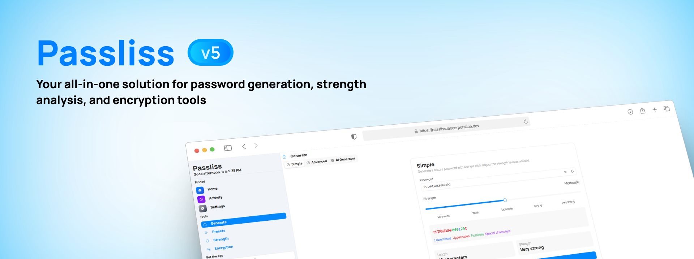
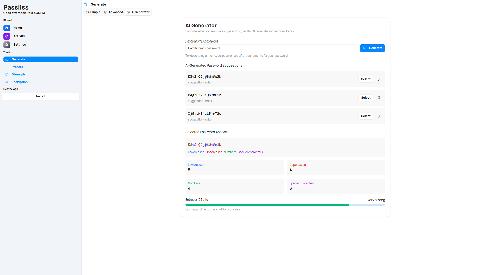
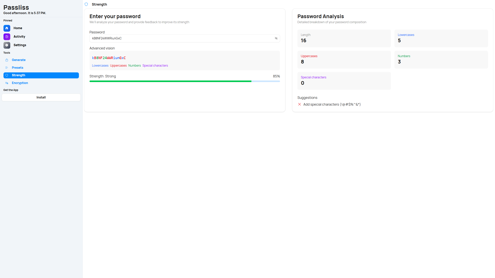
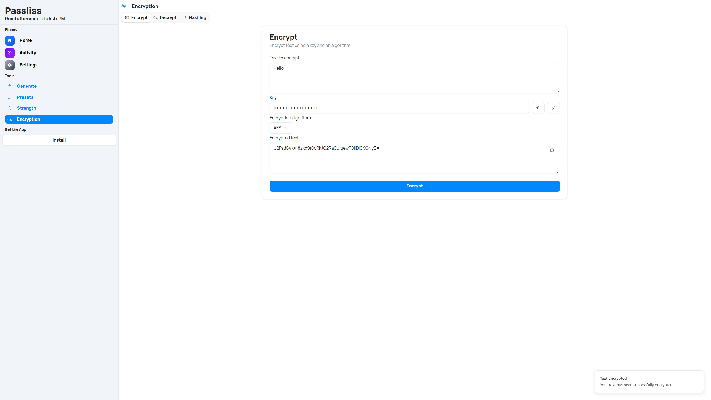

[](https://app.netlify.com/sites/passliss/deploys)


<br />
<p align="center">
  <a href="https://github.com/Leo-Corporation/Passliss">
    
  </a>
  <h1 align="center">Passliss</h1>

  <p align="center">
    Passliss is a web application that allows you to generate secure passwords, test the strength of exiting ones and more.
    <br />
    <a href="https://passliss.leocorporation.dev"><strong>Launch »</strong></a>
    <br />
    <a href="https://github.com/Leo-Corporation/Passliss/issues/new?assignees=&labels=bug&template=bug-report.yml&title=%5BBug%5D+">Report Bug</a>
    ·
    <a href="https://github.com/Leo-Corporation/Passliss/issues/new?assignees=&labels=enhancement&template=feature-request.yml&title=%5BEnhancement%5D+">Request Feature</a>
    ·
    <a href="https://github.com/Leo-Corporation/Passliss/issues?q=is%3Aopen+is%3Aissue+label%3Abug">Known Issues</a>

  </p>
</p>

## What is it?



Passliss is a modern and secure web application for generating, analyzing, and managing passwords. It provides a clean interface, AI-powered tools, encryption utilities, and full customization to help users stay safe online.

Built with **Next.js**, **React**, and **TypeScript**, Passliss delivers speed, reliability, and a powerful set of features for both casual and advanced users.

[**Launch »**](https://passliss.leocorporation.dev)

## Features

Passliss offers a wide range of security-focused features:

### Password Generator



The Generate page offers complete flexibility for creating random passwords:

- Choose the exact length
- Include or exclude symbols, numbers, uppercase or lowercase characters
- Generate multiple passwords in one click
- Export results as a CSV for secure storage or transfer

It also includes a simplified mode for quick generation and an advanced mode for fine-tuning every detail.

Passliss also integrates OpenAI’s GPT-4o-mini to let you generate secure passwords from natural language prompts. Whether you want a password that's "12 characters, includes symbols and is easy to remember" or "a banking-grade passphrase," the AI adapts to your needs and delivers strong, context-aware results.

### Strength Analysis



Easily evaluate the security of any password. The Strength page provides:

- A real-time strength score

- Detailed suggestions for improvement

- Visual indicators and contextual tips This helps users better understand how to avoid weak or easily guessable passwords.

### Encryption & Decryption



Secure strings using trusted algorithms like AES and Triple-DES. Hashing support is also included.

### Customization

You can modify default settings, themes, and presets via the Settings page in the app. Presets are pre-defined configurations for the password generator, allowing you to quickly select a set of options that suit your needs.

## Running locally - Getting Started

### Prerequisites

- Node.js (v20 or newer)

### Installation

```bash
git clone https://github.com/Leo-Corporation/Passliss.git
cd Passliss
npm install --legacy-peer-deps # required for react@19
npm run dev
```

Then open `http://localhost:3000` in your browser.

## Technologies Used

- [Next.js](https://nextjs.org/)
- [React](https://react.dev/)
- [TypeScript](https://www.typescriptlang.org/)
- [shadcn/ui](https://ui.shadcn.com/) for UI components
- [OpenAI API](https://platform.openai.com/) for AI password generation

## Localization

Passliss supports multiple languages and includes a locale switcher in the Settings page. You can add or modify translations in the `messages/` directory.

## Contribute

To contribute to the project, you'll need:

- Microsoft Visual Studio Code
- Node.js and `npm`.
- Git

[Click here](https://github.com/Leo-Corporation/Passliss/blob/main/CONTRIBUTING.md) to see the full guidelines.

## Branches

This Git repo has always two branches:

|  Name   |                                                                    Release                                                                     |             Description             |
| :-----: | :--------------------------------------------------------------------------------------------------------------------------------------------: | :---------------------------------: |
| `main`  |                                            |           Stable versions           |
| `vNext` |  | Next version of Passliss (unstable) |

## License

This project is under the [MIT License](https://github.com/Leo-Corporation/Passliss/blob/main/LICENSE).
